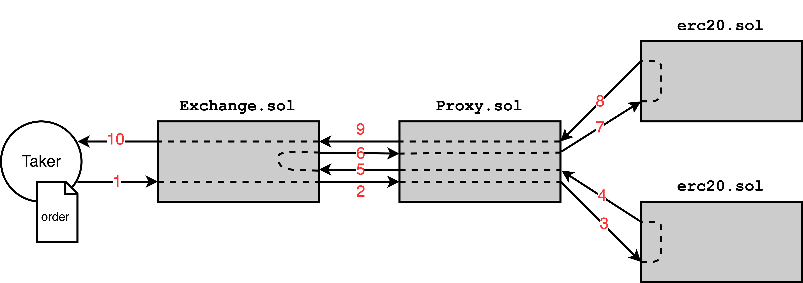
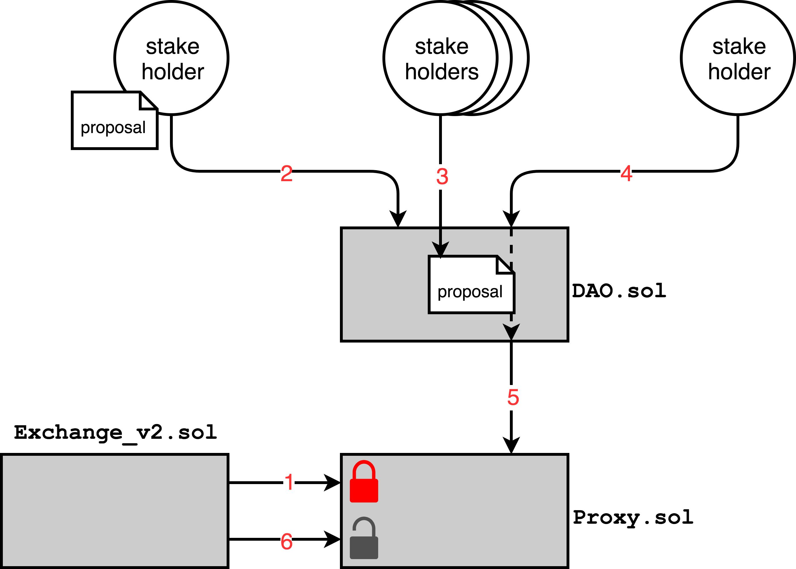
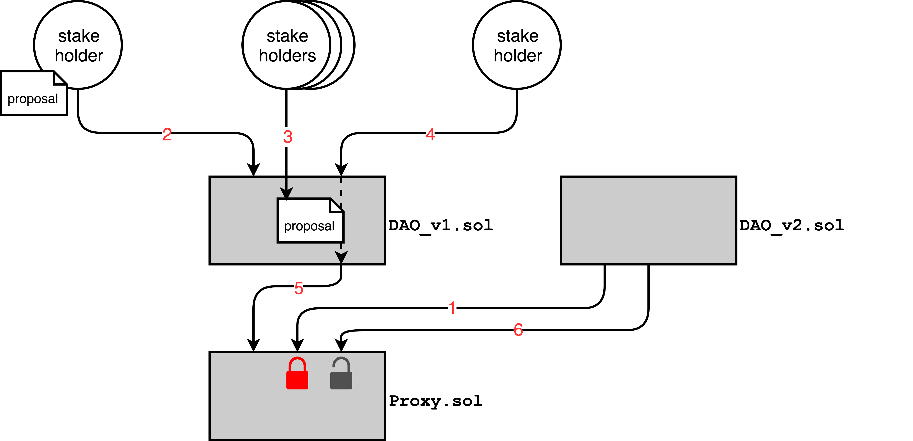

---

[0x][website-url] is an open protocol that facilitates trustless, low friction exchange of Ethereum-based assets. A full description of the protocol may be found in our [whitepaper][whitepaper-url]. This repository contains the system of Ethereum smart contracts comprising 0x protocol's shared on-chain settlement layer, native token (ZRX) and decentralized governance structure. Truffle is used for deployment. Mocha is used for unit tests.

[website-url]: https://0xproject.com/
[whitepaper-url]: https://0xproject.com/pdfs/0x_white_paper.pdf

[](http://slack.0xProject.com)
[](https://gitter.im/0xProject/contracts?utm_source=badge&utm_medium=badge&utm_campaign=pr-badge&utm_content=badge)
[](https://opensource.org/licenses/Apache-2.0)

## Table of Contents

* [Bug Bounty](#bug-bounty)
* [Architecture](#architecture)
* [Contracts](#contracts)
    * [Deployed Addresses](#deployed-addresses)
        * [Kovan](#kovan)
        * [Mainnet](#mainnet)
    * [Contract Interactions](#contract-interactions)
* [Protocol Specification](#protocol-specification)
    * [Message Format](#message-format)
* [Setup](#setup)
    * [Installing Dependencies](#installing-dependencies)
    * [Running Tests](#running-tests)
* [Contributing](#contributing)

## Bug Bounty

The Bug Bounty is now live! Details regarding compensation for reported bugs can be found [here](https://blog.0xproject.com/announcing-the-0x-protocol-bug-bounty-b0559d2738c). Submissions should be based off of commit [ebf8ccfb012e2533094f00d6e813e6a086548619](https://github.com/0xProject/contracts/tree/ebf8ccfb012e2533094f00d6e813e6a086548619). Please e-mail all submissions to team@0xProject.com with the subject "BUG BOUNTY". Note that submissions already reported in our [security audits](https://github.com/ConsenSys/0x_review) or GitHub issues will not be eligible.

The following contracts are within the scope of the bug bounty:

#### Core Contracts
* [Exchange.sol](https://github.com/0xProject/contracts/blob/ebf8ccfb012e2533094f00d6e813e6a086548619/contracts/Exchange.sol)
* [TokenTransferProxy.sol](https://github.com/0xProject/contracts/blob/ebf8ccfb012e2533094f00d6e813e6a086548619/contracts/TokenTransferProxy.sol)
* [TokenRegistry.sol](https://github.com/0xProject/contracts/blob/ebf8ccfb012e2533094f00d6e813e6a086548619/contracts/TokenRegistry.sol)
* [ZRXToken.sol](https://github.com/0xProject/contracts/blob/ebf8ccfb012e2533094f00d6e813e6a086548619/contracts/tokens/ZRXToken.sol)
* [MultiSigWalletWithTimeLockExceptRemoveAuthorizedAddress.sol](https://github.com/0xProject/contracts/blob/ebf8ccfb012e2533094f00d6e813e6a086548619/contracts/MultiSigWalletWithTimeLockExceptRemoveAuthorizedAddress.sol)
* [TokenSale.sol](https://github.com/0xProject/contracts/blob/ebf8ccfb012e2533094f00d6e813e6a086548619/contracts/TokenSale.sol)

#### Wallets
* [MultiSigWallet.sol](https://github.com/0xProject/contracts/blob/ebf8ccfb012e2533094f00d6e813e6a086548619/contracts/base/MultiSigWallet.sol) (There is an additional growing bug bounty for this contract [here](https://www.reddit.com/r/ethdev/comments/6qaxc1/bug_bounty_on_the_consensys_and_whitelisted/))
* [MultiSigWalletWithTimeLock.sol](https://github.com/0xProject/contracts/blob/ebf8ccfb012e2533094f00d6e813e6a086548619/contracts/MultiSigWalletWithTimeLock.sol)
* [VestingWallet.sol](https://github.com/0xProject/vesting-wallet/blob/5b546aaa28cca843d52c01bc02800d702f6f6135/contracts/VestingWallet.sol) (This is in a different repo, found [here](https://github.com/0xProject/vesting-wallet))

#### Tokens
* [EtherToken.sol](https://github.com/0xProject/contracts/blob/ebf8ccfb012e2533094f00d6e813e6a086548619/contracts/tokens/EtherToken.sol)
* [StandardTokenWithOverflowProtection.sol](https://github.com/0xProject/contracts/blob/ebf8ccfb012e2533094f00d6e813e6a086548619/contracts/base/StandardTokenWithOverflowProtection.sol)
* [StandardToken.sol](https://github.com/0xProject/contracts/blob/ebf8ccfb012e2533094f00d6e813e6a086548619/contracts/base/StandardToken.sol)

#### Base Contracts
* [Ownable.sol](https://github.com/0xProject/contracts/blob/ebf8ccfb012e2533094f00d6e813e6a086548619/contracts/base/Ownable.sol)
* [SafeMath.sol](https://github.com/0xProject/contracts/blob/ebf8ccfb012e2533094f00d6e813e6a086548619/contracts/base/SafeMath.sol)

## Architecture

0x uses a modular system of Ethereum smart contracts, allowing each component of the system to be upgraded without effecting the other components or causing active markets to be disrupted. The business logic that is responsible for executing trades is separated from governance logic and trading balance access controls. Not only can the trade execution module be swapped out, so can the governance module.


## Contracts

### Descriptions

#### [Exchange.sol](https://github.com/0xProject/contracts/tree/master/contracts/Exchange.sol)
Exchange contains all business logic associated with executing trades and cancelling orders. Exchange accepts orders that conform to 0x message format, allowing for off-chain order relay with on-chain settlement. Exchange is designed to be replaced as protocol improvements are adopted over time. It follows that Exchange does not have direct access to ERC20 token allowances; instead, all transfers are carried out by TokenTransferProxy on behalf of Exchange.

#### [TokenTransferProxy.sol](https://github.com/0xProject/contracts/tree/master/contracts/TokenTransferProxy.sol)
TokenTransferProxy is analogous to a valve that may be opened or shut by MultiSigWalletWithTimeLock, either allowing or preventing Exchange from executing trades. TokenTransferProxy plays a key role in 0x protocol's update mechanism: old versions of the Exchange contract may be deprecated, preventing them from executing further trades. New and improved versions of the Exchange contract are given permission to execute trades through decentralized governance implemented within a DAO (for now we use MultiSigWallet as a placeholder for DAO).

#### [MultiSigWalletWithTimeLockExceptRemoveAuthorizedAddress.sol](https://github.com/0xProject/contracts/tree/master/contracts/MultiSigWalletWithTimeLockExceptRemoveAuthorizedAddress.sol)
MultiSigWalletWithTimeLockExceptRemoveAuthorizedAddress is a temporary placeholder contract that will be replaced by a thoroughly researched, tested and audited DAO. MultiSigWalletWithTimeLock is based upon the [MultiSigWallet](https://github.com/ConsenSys/MultiSigWallet) contract developed by the Gnosis team, but with an added mandatory time delay between when a proposal is approved and when that proposal may be executed. This speed bump ensures that the multi sig owners cannot conspire to push through a change to 0x protocol without end users having sufficient time to react. An exception to the speed bump is made for revoking access to trading balances in the unexpected case of a bug being found within Exchange. MultiSigWalletWithTimeLock is the only entity with permission to grant or revoke access to the TokenTransferProxy and, by extension, ERC20 token allowances. MultiSigWalletWithTimeLock is assigned as the `owner` of TokenTransferProxy and, once a suitable DAO is developed, MultiSigWalletWithTimeLock will call `TokenTransferProxy.transferOwnership(DAO)` to transfer permissions to the DAO.

#### [TokenRegistry.sol](https://github.com/0xProject/contracts/tree/master/contracts/TokenRegistry.sol)
TokenRegistry stores metadata associated with ERC20 tokens. TokenRegistry entries may only be created/modified/removed by MultiSigWallet (until it is replaced by a suitable DAO), meaning that information contained in the registry will generally be trustworthy. 0x message format is not human-readable making it difficult to visually verify order parameters (token addresses and exchange rates); the TokenRegistry can be used to quickly verify order parameters against audited metadata.

### Deployed Addresses

#### Kovan

Commit Hash: ?

Branch: ?

* Exchange.sol: [0x63869171a246622ef8f9234879ce2c06cebd85f6](https://kovan.etherscan.io/address/0x63869171a246622ef8f9234879ce2c06cebd85f6)
* TokenTransferProxy.sol: [0x946a1c437fb5a61bd5c95416346e684c802c5d2a](https://kovan.etherscan.io/address/0x946a1c437fb5a61bd5c95416346e684c802c5d2a)
* MultiSigWalletWithTimeLock.sol: [0xa9a207b3df3f0d3ca33acf399e9af5db5902db39](https://kovan.etherscan.io/address/0xa9a207b3df3f0d3ca33acf399e9af5db5902db39)
* TokenRegistry.sol: [0x0fea265f59495859467e648ec99a87549aa6ede0](https://kovan.etherscan.io/address/0x0fea265f59495859467e648ec99a87549aa6ede0)

#### Mainnet

Commit Hash: TBD

Branch: TBD

* Exchange.sol: TBD
* TokenTransferProxy.sol: TBD
* MultiSigWalletWithTimeLockExceptRemoveAuthorizedAddress.sol: TBD
* TokenRegistry.sol: TBD

### Contract Interactions

The diagrams provided below demonstrate the interactions that occur between the various 0x smart contracts when executing trades or when upgrading exchange or governance logic. Arrows represent external function calls between Ethereum accounts (circles) or smart contracts (rectangles): arrows are directed from the caller to the callee.

#### Trade Execution (excl. fees)



Transaction #1
1. `Exchange.fillOrder(order, value)`
2. `TokenTransferProxy.transferViaTokenTransferProxy(token, from, to, value)`
3. `Token(token).transferFrom(from, to, value)`
4. Token: (bool response)
5. TokenTransferProxy: (bool response)
6. `TokenTransferProxy.transferViaTokenTransferProxy(token, from, to, value)`
7. `Token(token).transferFrom(from, to, value)`
8. Token: (bool response)
9. TokenTransferProxy: (bool response)
10. Exchange: (bool response)

#### Upgrading the Exchange Contract



Transaction #1

1. `TokenTransferProxy.transferFrom(token, from, to, value)` 🚫

Transaction #2

2. `DAO.submitTransaction(destination, bytes)`

Transaction #3 (one tx per stakeholder)

3. `DAO.confirmTransaction(transactionId)`

Transaction #4

4. `DAO.executeTransaction(transactionId)`
5. `TokenTransferProxy.addAuthorizedAddress(Exchangev2)`

Transaction #5

6. `TokenTransferProxy.transferFrom(token, from, to, value)` ✅

#### Upgrading the Governance Contract



Transaction #1

1. `TokenTransferProxy.doSomething(...)` 🚫

Transaction #2

2. `DAOv1.submitTransaction(destination, bytes)`

Transaction #3 (one tx per stakeholder)

3. `DAOv1.confirmTransaction(transactionId)`

Transaction #4

4. `DAOv1.executeTransaction(transactionId)`
5. `TokenTransferProxy.transferOwnership(DAOv2)`

Transaction #5

6. `TokenTransferProxy.doSomething(...)`  ✅

## Protocol Specification

### Message Format

Each order is a data packet containing order parameters and an associated signature. Order parameters are concatenated and hashed to 32 bytes via the Keccak SHA3 function. The order originator signs the order hash with their private key to produce an ECDSA signature.

Name | Data Type | Description
--- | --- | ---
exchangeContractAddress | `address` | Address of the Exchange contract. This address will change each time the protocol is updated.
maker | `address` | Address originating the order.
taker | `address` | Address permitted to fill the order (optional).
makerToken | `address` | Address of an ERC20 Token contract.
takerToken | `address` | Address of an ERC20 Token contract.
makerTokenAmount | `uint256` | Total units of makerToken offered by maker.
takerTokenAmount | `uint256` | Total units of takerToken requested by maker.
expirationTimestampInSec | `uint256` | Time at which the order expires (seconds since unix epoch).
salt | `uint256` | Arbitrary number that allows for uniqueness of the order's Keccak SHA3 hash.
feeRecipient | `address` | Address that recieves transaction fees (optional).
makerFee | `uint256` | Total units of ZRX paid to feeRecipient by maker.
takerFee | `uint256` | Total units of ZRX paid to feeRecipient by taker.
v | `uint8` | ECDSA signature of the above arguments.
r | `bytes32` | ECDSA signature of the above arguments.
s | `bytes32` | ECDSA signature of the above arguments.

## Setup

### Installing Dependencies

Install [Node v6.9.1](https://nodejs.org/en/download/releases/)

Install project dependencies:

```
npm install
```

### Running Tests

Start Testrpc

```
npm run testrpc
```

Compile contracts

```
npm run compile
```

Run tests

```
npm run test
```

## Contributing

0x protocol is intended to serve as an open technical standard for EVM blockchains and we strongly encourage our community members to help us make improvements and to determine the future direction of the protocol. To report bugs within the 0x smart contracts or unit tests, please create an issue in this repository.

### ZEIPs
Significant changes to 0x protocol's smart contracts, architecture, message format or functionality should be proposed in the [0x Improvement Proposals (ZEIPs)](https://github.com/0xProject/ZEIPs) repository. Follow the contribution guidelines provided therein.

### Coding conventions

We use a custom set of [TSLint](https://palantir.github.io/tslint/) rules to enforce our coding conventions.

In order to see style violation errors, install a tslinter for your text editor. e.g Atom's [atom-typescript](https://atom.io/packages/atom-typescript).
